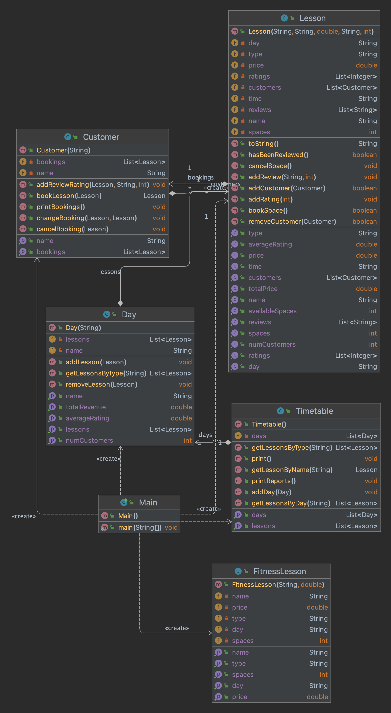

# Report

## Structure

The codebase consists of three classes: Main, Timetable, Day, Lesson, FitnessLesson and Customer.

The Main class contains the main method and is responsible for creating and managing the list of fitness lessons, creating the timetable, creating and managing the list of customers, and providing a menu for the user to interact with the system.

The Timetable class represents the timetable for the fitness center and contains a list of Day objects. Each Day object represents a day of the week and contains a list of Lesson objects. Each Lesson object represents a fitness lesson and contains information such as the name, type, time, day, and number of available spaces. The Timetable class also provides methods for adding days and lessons, getting lessons by day or fitness type, and printing the timetable.

The Day class represents a day of the week and contains a list of Lesson objects. The Day class also provides methods for adding lessons, getting lessons by fitness type, and printing the lessons for the day.

The Lesson class represents a fitness lesson and contains information such as the name, type, time, day, and number of available spaces. The Lesson class also provides methods for getting and setting the number of available spaces, and printing the lesson details.

The FitnessLesson class is a subclass of the Lesson class and represents a fitness lesson with a fixed price. The FitnessLesson class also provides methods for getting and setting the price, and printing the lesson details.

The Customer class represents a customer of the fitness center and contains information such as the name and a list of booked lessons. Each booked lesson is represented by a Lesson object and can be added, changed, or cancelled. The Customer class also provides a method for printing the list of booked lessons.

Overall, the codebase follows an object-oriented structure with clear separation of concerns between the Main, Timetable, and Customer classes. The classes and methods are well-named and organized, making it easy to understand and modify the code.

## UML

## WFC Package UML

1. Class UML 

2. Method UML

3. Constructor UML

4. Fields UML

5. Properties UML

## Design Assumptions 

Based on the given requirement and files, the design assumptions of the system can be categorized into the following types:

1. Functional assumptions:
    - The fitness center offers a fixed set of fitness lessons, each with a specific name, type, time, and number of available spaces.
    - The fitness center operates on a weekly schedule with fixed days of the week.
    - Customers can book, change, or cancel lessons, but cannot create new lessons or change the schedule of existing lessons.
    - Customers can only book lessons that have available spaces.
    - Customers can only book one lesson at a time.
    - Customers can write reviews and provide ratings for lessons they have booked.

2. Non-functional assumptions:
    - The system calculates revenue based on the total number of lessons booked and their respective prices.
    - The system provides reports on the number of customers and average rating per lesson on each day, as well as the total revenue for each fitness type.

These assumptions define the basic functionality and behavior of the system, as well as its performance and reporting capabilities. They provide a clear understanding of what the system is designed to do and how it is expected to perform.

## Design Principles 

The design principles based on which the system was designed are as follows:

*Object-oriented programming (OOP):* The codebase follows the principles of OOP, with classes representing real-world entities such as customers, lessons, and the timetable. Each class has its own set of properties and methods, and objects are created from these classes to interact with the system.

*Single Responsibility Principle (SRP):* Each class has a single responsibility and is focused on a specific aspect of the system. For example, the Timetable class is responsible for managing the schedule of lessons, while the Customer class is responsible for managing the bookings of individual customers.

*Open/Closed Principle (OCP):* The codebase is designed to be open for extension but closed for modification. For example, new types of fitness lessons can be added to the system without modifying the existing code, by creating a new subclass of the Lesson class.

*Dependency Injection (DI):* The Main class uses DI to inject dependencies such as the timetable and list of customers into other classes, rather than creating them directly. This allows for greater flexibility and easier testing of the system.

*Encapsulation:* Each class encapsulates its own data and behavior, and provides public methods for interacting with the data. This helps to ensure that the data is accessed and modified in a controlled and consistent manner.

*Polymorphism:* The codebase makes use of polymorphism to allow for different types of lessons to be treated as a single type. For example, the FitnessLesson class is a subclass of the Lesson class, and can be used interchangeably with other types of lessons in the system.

## Refactoring 

Most of the code's logic and functions underwent refactoring, either during the initial implementation or after it. The use of techniques such as method extraction and abstraction helped enhance the code. 

Nonetheless, certain portions of the application are still waiting to be refactored due to time limitations. The refactoring process will remain a top priority for this project in the future.

## Git Log

## Screenshots 

Incase the .jar file provided does not run properly on the marker's machine, the screenshots of the application are provided below will give some insight into the application's functionality.

**Note** All the screenshots represent the condition when no data about the lessons is added to the system. Basically dry run.

